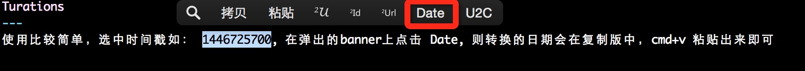
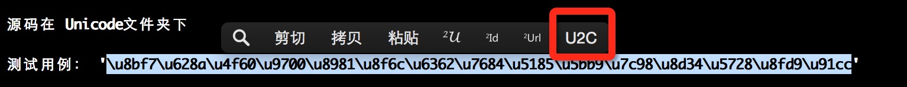

About
---
> 本项目是PopClip的一个插件集合，用于时间戳和日期之间的相互转化，时区为：北京; 用于UTF-8和Unicode之间的转码

Install
----
1. 安装popclip
2. 双击 pkg文件夹下面的 Date.popclipext（实际上是个文件夹，扩展名为popclipext）
3. 同意安装

Source Code
------
> 两个php file是具体执行的脚本，Config.plist是PopClip插件的配置文件

### 1. Date/
时间戳和日期的相互转换

后续需要考虑日期的多样性转换支持

### 2. Unicode/
unicode和utf8的相互转换

后续完善emoj表情的支持

Connect me
----
### mail to: bangzewu@126.com

***

Plugin
---
1. 时间戳和日期的相互转换
	- 使用比较简单，选中时间戳如： 1446725700, 在弹出的banner上点击 Date, 则转换的日期会在复制版中，cmd+v 粘贴出来即可

		

2. unicode字符转中文的插件： pkg/Unicode.popclipext, 安装方法依然是双击

   - 源码在 Unicode文件夹
   - 测试用例： `\u8bf7\u628a\u4f60\u9700\u8981\u8f6c\u6362\u7684\u5185\u5bb9\u7c98\u8d34\u5728\u8fd9\u91cc`
   - 复制上面的文档，点击2UTF8，粘贴出来的即为中文字符
   - 2Unicode是将utf-8格式的字符串转换为unicode码

     
     
   - **TODO：** 支持Emoj表情的编码

TIP
---
打包安装方法

- 新建一个文件夹，后缀为.popclipext，将.plist和脚本文件拷贝到新的文件夹下
- 压缩： `zip -r xxx.popclipextz  xxx.popclipext/`
- 双击上面生成的文件，确认安装即可
